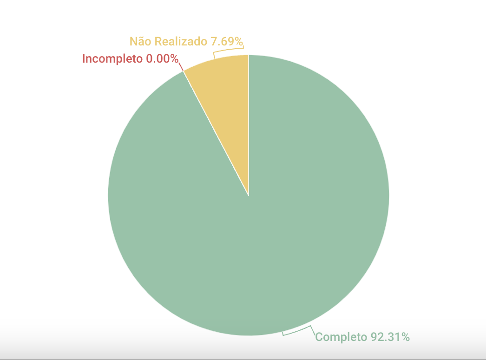

# MosCow

## 1. Introdução
Esse artefato visa realizar a verificação do artefato MosCow produzido pelo nosso próprio grupo, que se encontra [nesse link](https://requisitos-de-software.github.io/2023.1-Twitch/elicitacao/priorizacao/).
É importante lembrar que a versão do artefato que foi verificada é a versão 1.3. 

## 2. Metodologia
Você pode conferir a metodologia utilizada para a verificação de nosso grupo [nesse link](https://requisitos-de-software.github.io/2023.1-Twitch/verificacao_grupo01/planejamento/).

## 3. Verificação

| ID |Questão| Resultado da Verificação |
| :---: | --- | :---: |
| 01 | O artefato possui uma introdução | Completo |
| 02 | O artefato possui a metodologia  | Completo |
| 03 | O artefato possui uma tabela com histórico de versões, com data, descrição, autor(es) e revisor(es)  | Completo |
| 04 | O artefato possui referências bibliográficas  | Completo |
| 05 | As tabelas e imagens do artefato possuem fontes, legendas e chamadas no texto | Completo |
| 06 | O artefato explica como funciona a metodologia de priorização do MosCow | Completo |
| 07 | O artefato explica como funciona a metodologia de priorização do MosCow | Completo |
| 08 | O artefato apresenta a participação do cliente ou persona na construção do MosCow | Não Realizado |
| 09 | O artefato explica como funciona a metodologia de priorização do MosCow | Completo |
| 10 | Os requisitos apresentados do artefatos estão separados por funcionais, não funcionais | Completo |
| 11 | Os requisitos estão classificados em Must-Have, Should-Have, Could-Have, Would/ Want/ Won't- Have | Completo |
| 12 | Os requisitos de acordo com os que foram elicitados pelas técnicas de elicitação utilizadas pelo grupo | Completo |

<h6 align = "center"> Tabela 1: Checklist para Verificação do Artefato MosCow
  Autor(es): Diógenes Dantas
 Fonte: Autor(es)</h6>

## 4. Observações

### ID - 08

Adicionar participação de clientes ou personas na construção do MosCow.

## 5. Resultados
A imagem 1 a seguir apresenta um gráfico de pizza apresentando os resultados contidos na Tabela 1.

<h6 align = "center"> Imagem 1: Resultados da Verificação do Artefato de MosCow
  Autor(es): Diógenes Dantas
 Fonte: Autor(es)</h6>

## 6. Observações Pertinentes do Grupo 07
A análise realizada pelo Grupo 07 a respeito do artefato MosCow se encontra [nesse link](https://requisitos-de-software.github.io/2023.1-Petz/analise/teste/moscow/).

As única observação apontada pelo Grupo 07 é o fato de que o artefato produzido pelo grupo 08 não utilizou uma persona e/ou um cliente no desenvolvimento da Técnica de Priorização Moscow. Segundo o Grupo 07, tendo como referência os slides "SERRANO, Milene, SERRANO, Maurício. Requisitos (Aula 07)", é necessário que a priorização seja com base nos requisitos que tenham maior valor de negócio para os clientes.

Além disso, o Grupo 07 destacou a falta informações sobre os motivos da priorização dos requisitos.

## Histórico de versão
|    Data    | Versão | Descrição                                                                      | Autor(es)  | Revisor  |
| :--------: | :----: | :----------------------------------------------------------------------------: | :--------: | :------: |
| 20.06.2023 | 1.0    | Adição da primeira versão do artefato de Verificação Rich Picture |  Diógenes  | Milena |
| 20.06.2023 | 1.1    | Adicão de checklist do MosCow, introdução, observações do grupo 07 e referencias|   Diógenes   | Milena |
| 20.06.2023 | 1.2    | Adicão de gráfico de pizza apresentando os resultados do CheckList do MosCow |   Diógenes   | Milena |
| 03.07.2023 | 2.0    | Adição de associação entre a questão da tabela do checklist e as referências do artefato. Artefato ajustado para a entrega final | Diógenes | Milena |

<h6 align = "center"> Tabela 2: Histórico de Versões
  Autor: Diógenes Dantas </h6>

## Referências

>SALES, André. Tabela utilizada para análise dos grupos. Disponível em: https://aprender3.unb.br/pluginfile.php/2523005/mod_resource/content/31/Plano_de_Ensino%20RE%20202301%20Turma%202.pdf. Acesso em: 20 de junho de 2023.

>rfc2119 -- Bradner, S., "Key words for use in RFCs to Indicate Requirement Levels," RFC 2119, March 1997 Método MosCoW. Voitto - BR, 01 ago. 2021. Disponível em https://www.voitto.com.br/blog/artigo/metodo-moscow

>SERRANO, Milene, SERRANO, Maurício. Requisitos (Aula 07). Disponível em: https://aprender3.unb.br/pluginfile.php/2523073/mod_resource/content/2/Requisitos%20-%20Aula%2007.pdf. Acesso em: 20 de junho de 2023