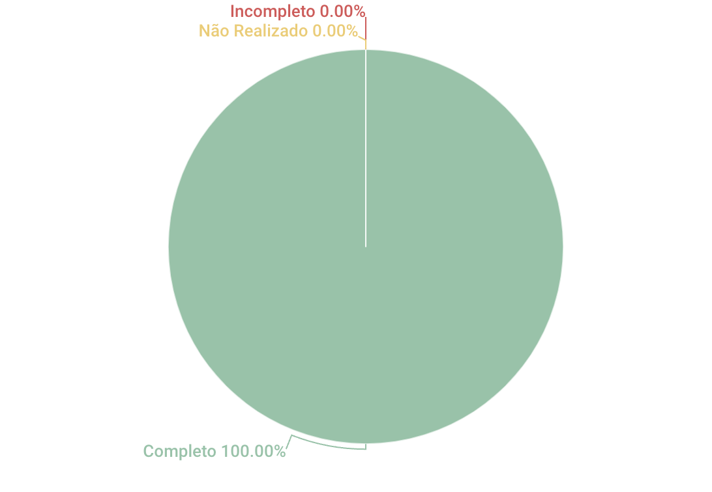

## 1. Introdução
Esse artefato visa realizar a verificação do artefato de Personas produzido pelo Grupo 01 - Bilheteria Digital, que se encontra [nesse link](https://requisitos-de-software.github.io/2023.1-BilheteriaDigital/elicitacao/perfil_de_usuario/).

## 2. Metodologia
Você pode conferir a metodologia utilizada para a verificação do Grupo 01 [nesse link](https://requisitos-de-software.github.io/2023.1-Twitch/verificacao_grupo01/planejamento/).

## 3. Verificação

A tabela 1 a seguir apresenta o checklist que orientou a verificação do Grupo 01 - Bilheteria Digital, da disciplina de Requisitos de Software no semestre 2023.01.

| ID |Questão| Resultado da Verificação |
| :---: | --- | :---: |
| 01 | O artefato possui uma introdução | Completo |
| 02 | O artefato possui a metodologia  | Completo |
| 03 | O artefato possui uma tabela com histórico de versões, com data, descrição, autor(es) e revisor(es)  | Completo |
| 04 | O artefato possui referências bibliográficas  | Completo |
| 05 | As tabelas e imagens do artefato possuem fontes e legendas | Incompleto, as imagens possuem apenas fonte e a tabela do histórico de versões não possui fonte, nem legenda |
| 06 | O artefato descreve os resultados obtidos, imagens ou texto | Completo |
| 07 | Os dados coletados para utilizar no perfil de usuário foram obtidos através de um estudo conduzido por entrevistas ou aplicação de questionário  | Completo |
| 08 | O artefato apresenta o termo de consentimento utilizado na coleta dos dados | Completo |
| 09 | O artefato identifica as características de interesse obtidos na coleta de dados, como nível de instrução, faixa etária, experiência, estado civil, atitudes (tecnófilos, tecnófobos) | Completo |
| 10 | O artefato explica como a coleta de dados foi usada para determinar o perfil de usuário principal do aplicativo analisado | Completo |

<h6 align = "center"> Tabela 1: Checklist para Verificação
  Autor(es): Diógenes Dantas
 Fonte: Autor(es)</h6>

## 4. Resultados
A imagem 1 a seguir apresenta um gráfico de pizza levando em consideração as 10 questões utilizadas para verificação do artefato de perfil de usuário:

<h6 align = "center"> Imagem 1: Resultados da Verificação do Perfil de Usuário
  Autor(es): Diógenes Dantas
 Fonte: Autor(es)</h6>

O artefato está bem completo e foi muito bem desenvolvido. Contudo, é necessário apenas que o Grupo 01 se atente as questões relacionadas as legendas e fontes das tabelas e imagens.
## Referências

>SALES, André. Tabela utilizada para análise dos grupos. Disponível em: https://aprender3.unb.br/pluginfile.php/2523005/mod_resource/content/31/Plano_de_Ensino%20RE%20202301%20Turma%202.pdf. Acesso em: 13 de junho de 2023.

>Courage, Catherine e Baxter, Kathy (2005). Understanding Your Users: A Practical Guide to User Requirements Methods, Tools, and Techniques. Morgan Kaufmann Publishers Inc., San Francisco, CA, USA, 1st edition. Acesso em: 13 de junho de 2023.

>Barbosa, S. D. J.; Silva, B. S. da; Silveira, M. S.; Gasparini, I.; Darin, T.; Barbosa, G. D. J. (2021) Interação Humano-Computador e Experiência do usuário. Autopublicação. ISBN: 978-65-00-19677-1. Acesso em: 13 de junho de 2023

## Histórico de Versões

A Tabela 3 registra o histórico de versão desse documento.

|    Data    | Versão | Descrição                                                                      | Autor(es)  | Revisor  |
| :--------: | :----: | :----------------------------------------------------------------------------: | :--------: | :------: |
| 13.06.2023 | 1.0    | Criação do documento de verificação do perfil de usuário (Bilheteria Digital) |   Diógenes   |    Rafael    |
| 13.06.2023 | 1.1    | Adição do Checklist da Verificação do perfil de usuário |   Diógenes   |    Rafael   |
| 13.06.2023 | 1.2    | Adição do gráfico de pizza explicando os resultados do checklist |   Diógenes   |    Rafael   |

<h6 align = "center"> Tabela 3: Histórico de Versões
  Autor(es): Diógenes Dantas
 Fonte: Autor(es)</h6>